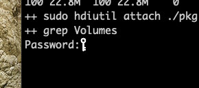

# Orchard printer setup

## For MacOS

1. Open a terminal
    - Press `CMD`+`Space` keys to open application launcher
    - Search "terminal"
    - Open the Terminal app
2. Run the install script
    - In the terminal, copy/paste the following text: `/bin/bash -c "$(curl -fsSL 'https://raw.githubusercontent.com/Developers-Institute/orchard-printer-setup/master/install-orchard-printer-mac.sh?token=AAPJLDT6SLSU3TCNE7DCSK265VKUK')"`
    - press `Enter` in the terminal to run the above command
    - It will ask for your password in the terminal. Type it in, but note it will not appear in the terminal (not even as `********`). Press enter.
    - 
    - It will likely ask permission, allow it by clicking `OK`
3. Add the printer
    - The `Printers & Scanners` settings dialog will have opened
    - Click the `[+]` button on the bottom/left of settings dialog
    - Click the `IP` icon with the globe icon
    - Select the `Address` input box and enter `10.1.0.20`
    - Select `Protocol` dropdown and choose `Line Printer Daemon - LPD`
    - Click `Add` button at bottom/right
4. Try to print something such as this instruction page you are reading now.
    - `File` => `Print...`
    - In Chrome and some other applications, you need to get to the system print dialog. Only the system print dialog works at the Orchard. For Chrome, click `More settings` => `Print using system dialog`
    - 

5. Configure printer presets
    - 

## For other operating systems

As we've only used MacOS so far, no other operating systems have been catered for by us yet.
Figure a process out using Orchard staff, and document it here.
